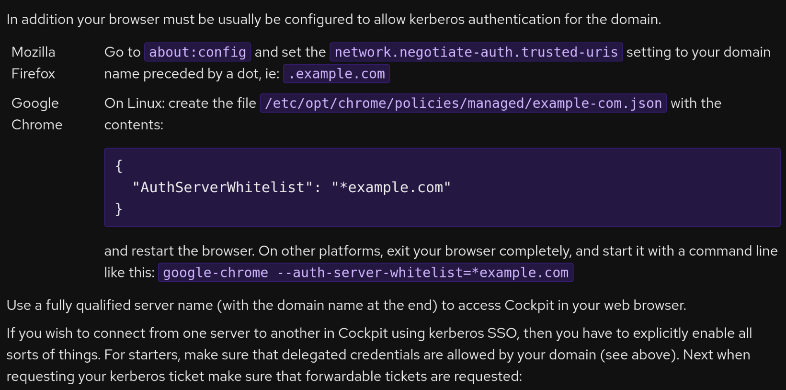
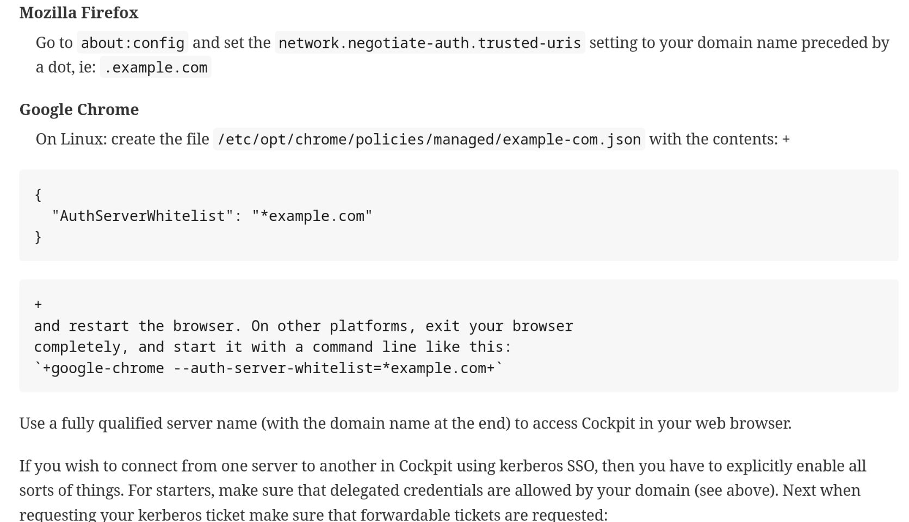
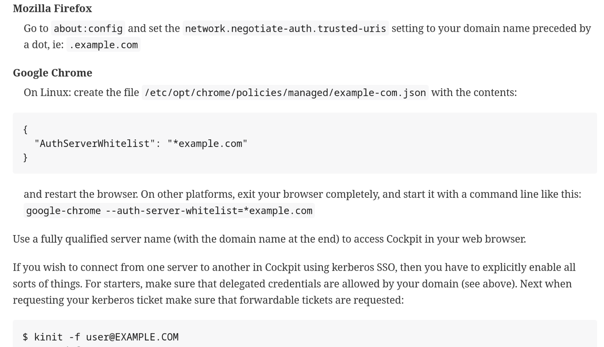

While working on Cockpit our elegant [@bookwar](https://fosstodon.org/@bookwar) began converting the [DocBook](https://docbook.org/) content over to [AsciiDoc](https://asciidoc.org). Main reason for this is for maintainability of the docs and general know-how around Fedora-community with AsciiDoc

With shifting focuses I ended up taking over the work to bring the conversion the rest of the way, but gosh did I encounter a lot of problems and I'm sure we'll get more

## AsciiDoctor

In general, having used [AsciiDoctor](https://asciidoctor.org/) for parsing AsciiDoc files has been great. Barely encountered issues but there were general asciidoc syntax woes with DocBook to AsciiDoc with [Pandoc](https://pandoc.org/).

AsciiDoctor is available in a lot of distributions but it wasn't in two distributions that Cockpit distributes to, namely RHEL and CentOS Stream, which meant we can't use it during build-time to generate docs. For those distributions we have to rely on something else, namely the legacy [asciidoc-py](#asciidoc-py).

But AsciiDoctor generates very nice HTML pages with great style, and Manpages that look and function well.

## asciidoc-py

Here is where issues start to appear, not only did we run into limitations with [asciidoc-py](https://asciidoc-py.github.io/) that is no longer an issue with [AsciiDoctor](#asciidoctor), I decided we should be AsciiDoctor first and asciidoc-py second. Which means using AsciiDoctor for most distributions and fallback to asciidoc-py when AsciiDoctor isn't available.

### Relative leveloffset

This might sound like a small issue but something that I tried solving for a day or two before I found anything useful. The long and short of it is that asciidoc-py does not support relative leveloffsets whereas AsciiDoctor does. On the other hand, asciidoc-py supports using `eval`s on leveloffset whereas AsciiDoctor is more strict and doesn't allow that.

Initially I had presumed that relative leveloffsets existed in asciidoc-py as there is no information online about it not supporting it. My first thought was that it was broken in asciidoc-py somehow when it came to nested imports. I had tried to use leveloffsets both in the includes and as page attributes

Using page attributes like this "seemed to work" when rendering at least
```asciidoc
# Title
:leveloffset: +1

include::filename.adoc[]
```

whereas using it per-include didn't

```asciidoc
# Title

include::filename.adoc[leveloffset+=1]
```

However, quickly realized that it just flat out didn't work in the rendered document. Which took forever to figure out. 

After a day of experimenting and searching online I did find an email in the now-abandoned asciidoc mailing list by Jeremiah Leary that helped me a lot. It taught me not only about the issue existing for others, but that it counter and eval was a thing you can use!

> Well, that worked on the way down the hierarchy, but coming up had some 
> issues.  So the complete solution looks like this:
> 
> ```asciidoc
> :leveloffset: {counter:leveloffset}
> 
> include::<filename>
> 
> :leveloffset: {eval:{leveloffset} - 1}
> ```
> 
> Now any of my files can be rendered at any level of document hierarchy.
>
> [Jeremiah Leary on asciidoc@googlegroups.com mailing list](https://www.mail-archive.com/asciidoc@googlegroups.com/msg05053.html)

Looking at the previous include I showed, we could now change it to the same as the above!

```asciidoc
# Title
:leveloffset: {counter:leveloffset}

include::filename.adoc[]

:leveloffset: {eval:{leveloffset} - 1}
```

Initial runs showed it worked great on asciidoc-py! Everything rendered correctly and we didn't have any issues. What was worrying though was that the asciidoc plugin in VS Code did show it as incorrect heading, and it proved to be correct when rendering with AsciiDoctor. Damn..

Issue with AsciiDoctor seems to be related to `eval` being used on a counter, as the issue only appears when `eval` is added. But given that the relative leveloffset works on AsciiDoctor it did give me an idea to try using relative leveloffset if you use AsciiDoctor and eval if you use asciidoc-py. Problem is again, there is no good variable that I could find that would be a clear distinction between asciidoc-py and AsciiDoctor. Instead, I ended up creating my own attribute `asciidoctor` and providing it to AsciiDoctor's arguments. Then we can simply check if the variable is defined or not and depending on that we use either implementation.

```asciidoc
# Title
:leveloffset: {counter:leveloffset}

include::filename.adoc[]

ifdef::asciidoctor[]
:leveloffset: -1
endif::[]

ifndef::asciidoctor[]
:leveloffset: {eval:{leveloffset} - 1}
endif::[]
```

To make this even easier to write across files I then just slit it up to a new file that had the if statements. I'm sure this can be done better using macros or something else though, but at least this worked and does work across the whole documentation generation.

```asciidoc
# Title
:leveloffset: {counter:leveloffset}

include::filename.adoc[]

include::leveloffset-helper.adoc[]
```

Success! So in short, avoid supporting both AsciiDoctor and asciidoc-py.

## Asciidoc confusion

With our migration from DocBook there were a few issues that I ran into. Such as description lists not working with code blocks, admonitions/notices not functioning with indentations, and lacking inline literal monospace in legacy asciidoc-py.

Description lists seemingly feel a lot different with the default styling that AsciiDoc offers. Looking at our [previous implementation in DocBook](https://github.com/cockpit-project/cockpit/blob/55513a80b016d1673f96a6988f68c2c02d686ede/doc/guide/sso.xml#L173-L197), you can see that we had an equivalent of a [horizontal AsciiDoc definition list](https://docs.asciidoctor.org/asciidoc/latest/lists/horizontal/). 



When converted as-is to AsciiDoc we get a normal description list and an attempt to continue the paragraphs using [hard-line breaks](https://docs.asciidoctor.org/asciidoc/latest/blocks/hard-line-breaks/) as it _should_ help ensure that the paragraphs are related to each-other. Notice how the code-block doesn't retain the indentation from the previous paragraph, this is likely one of the culprits to why this breaks so horrendously. 

```asciidoc
Mozilla Firefox::
  Go to `+about:config+` and set the
  `+network.negotiate-auth.trusted-uris+` setting to your domain name
  preceded by a dot, ie: `+.example.com+`
Google Chrome::
  On Linux: create the file
  `+/etc/opt/chrome/policies/managed/example-com.json+` with the
  contents: +
  +
....
{
  "AuthServerWhitelist": "*example.com"
}
....
  +
  and restart the browser. On other platforms, exit your browser
  completely, and start it with a command line like this:
  `+google-chrome --auth-server-whitelist=*example.com+`
```

At first glance this looks strange but should probably work? Rendering it though shows something else..



Heck, so not only does the last paragraph become a code snippet - due to the indentation being processed as is - the actual code snippet unsurprisingly doesn't have the same indentation as the description list item either. If we indent the code snippet to the same indentation it just becomes a code snippet containing the "code snippet", [indentations by themselves function similarly to Markdown in that they create literal blocks](https://docs.asciidoctor.org/asciidoc/latest/verbatim/literal-blocks/#indent-method), which is not what we want at all.

Fixing this becomes a bit of a hassle, isn't intuitive, nor does it work for the code snippets themselves - at least with the indentation. First off we can try to make the code snippet and last paragraph a new description list by using the [`{empty}` content](https://docs.asciidoctor.org/asciidoc/latest/blocks/#content-model), which renders an empty list but at least fixes the text. Since we're using `{empty}` we can also get rid of the hard-line breaks (`+`) completely. 

```asciidoc
Mozilla Firefox::
  Go to `+about:config+` and set the
  `+network.negotiate-auth.trusted-uris+` setting to your domain name
  preceded by a dot, ie: `+.example.com+`
Google Chrome::
  On Linux: create the file
  `+/etc/opt/chrome/policies/managed/example-com.json+` with the
  contents:

{empty}::
....
{
  "AuthServerWhitelist": "*example.com"
}
....

{empty}::
  and restart the browser. On other platforms, exit your browser
  completely, and start it with a command line like this:
  `+google-chrome --auth-server-whitelist=*example.com+`
```

When rendered is "good enough", at least for the initial conversion. It works and doesn't look bad, just doesn't look as good as I'd want it to. I suspect we should be changing this to something other than a description list in the future and instead rely on some other type of content block.



### Admonitions

Notices, warnings, infos - also known as [admonitions](https://docs.asciidoctor.org/asciidoc/latest/blocks/admonitions/), are a great tool to use when you want to highlight something important. Even there though we get into the same issue as mentioned in [Asciidoc confusion section](#asciidoc-confusion) as indentation within description lists break admonitions completely and instead renders it as a literal/code block. 

Working around this isn't really possible from what I can gather, instead we just have to remember to not indent the content and instead display it inline.

### Inline literal monospace

[Monospace does exist in AsciiDoc](https://docs.asciidoctor.org/asciidoc/latest/text/monospace/) and is supported both by asciidoc-py and AsciiDoctor, which when rendered is functioning as one would expect it to work. But if you want to use literal monospace, where characters are processed as-is - which is how it works in all Markdown processors I've seen, you need to make sure not to include any characters that could be rendered within the monospace as asciidoc-py does not support it and instead renders it as a monospace.

Instead of literal monospace syntax being rendered, which is written as:
```
`+Text+`
```

asciidoc-py instead renders the above snippet to `+Text+`. If you were to include italic, bold, or anything like that it would render it within the monospace as normal as well. Not ideal!

No real workaround exists for this as far as I can tell, but for Cockpit at least it's not a huge issue, but something that we definitely have to think about.

## Future Antora integration with Cockpit

While the AsciiDoc migration took way longer than I wanted, we aren't really there yet! I still want to get us over to [Antora](https://antora.org/) to make the Cockpit documentation look better than it currently does. I did experiment with it a bit in the [migration PR](https://github.com/cockpit-project/cockpit/pull/21515) but we removed it to reduce the complexity of the PR for now. 

I want something that is made for documentation and not just our own pages wrapped in our Cockpit website. While the Antora configuration files did exist in the PR I did manage to create a [test website to see how Antora would look and function like](https://venefilyn.se/cockpit-docs). Suffice to say it does work great and is definitely is the way to go with multi-page asciidoc documentation, at least for now.
